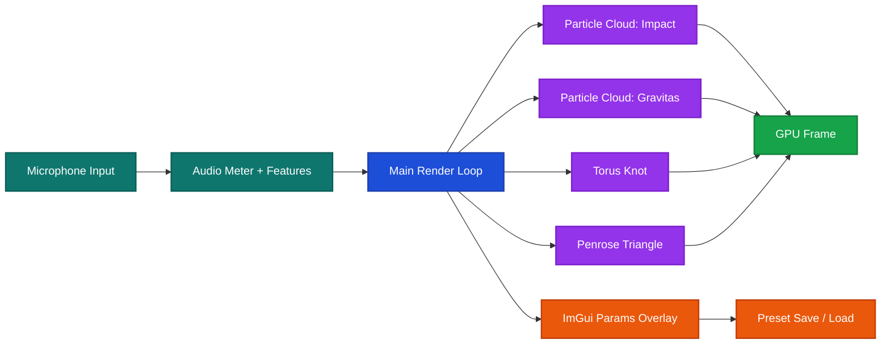
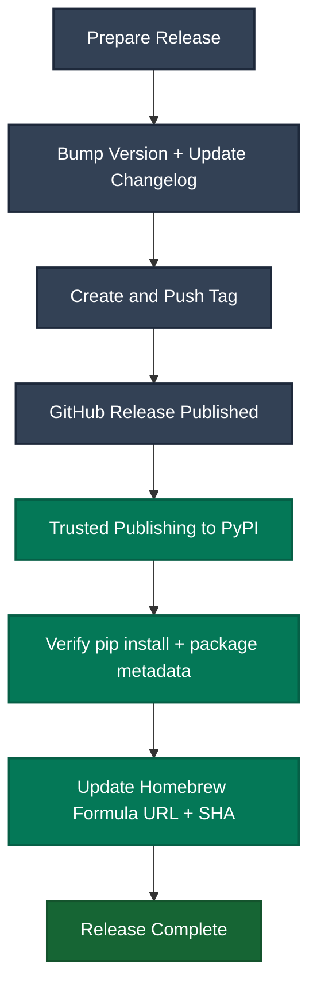

# Particled

Audio-reactive particle visualizer with multiple visualization styles and modes.

## Status

- Runtime and packaging are release-hardened for PyPI/Homebrew workflows.
- CI includes Linux and macOS checks for lint, tests, type checks, and build validation.
- Publish workflows are in place; remaining release steps are maintainer submission actions.

## Overview

Particled is a real-time particle visualization system that responds to microphone input, featuring:

- **Torus Knot**: Complex mathematical knot patterns with 3D geometry
- **Particle Cloud - Gravitas Mode**: Physics-based gravity-centered expansion with audio reactivity
- **Particle Cloud - Impact Mode**: Whole-cloud breathing animation with gentle drift
- **Penrose Triangle**: Impossible triangle geometry with audio-reactive particle flow



## Features

- Real-time audio reactivity via microphone input
- Multiple visualization styles and sub-modes
- Interactive CLI configuration
- Runtime parameters panel with live tuning
- Per-band particle count and size mapping (8 configurable bands)
- Preset save/load from the parameters panel
- Resizable window with fullscreen support
- Configurable particle physics and return mechanics
- Frequency-based particle mapping (Gravitas mode)
- Adjustable motion trails and visual effects

## Installation

Requires Python 3.13+ and Poetry.

### System dependencies

**PortAudio** (required by `sounddevice` for microphone input):

```bash
# Ubuntu / Debian
sudo apt install -y libportaudio2 portaudio19-dev

# macOS
brew install portaudio
```

**SDL2** (only needed if building `pygame-ce` from source — pre-built wheels are available for most platforms):

```bash
# Ubuntu / Debian
sudo apt install -y libsdl2-dev libsdl2-image-dev libsdl2-mixer-dev libsdl2-ttf-dev
```

### Install

```bash
# Clone the repository
git clone https://github.com/crafted-glitches/particled.git
cd particled

# Install dependencies
poetry install
```

### Optional: install as a package command

```bash
python -m pip install -e .
particled --version
```

## Quick Start

```bash
# Run with interactive configuration
poetry run particled --selective

# Or run with defaults
poetry run particled

# Version check (non-interactive)
poetry run particled --version
```

## Post-install Usage (pip)

After installing from PyPI, run Particled with:

```bash
particled
particled --selective
particled --version
```

If the `particled` command is not on your PATH, use:

```bash
python -m particled
```

The application will prompt you to:
1. Select visualization style (Torus Knot or Particle Cloud)
2. Select mode (for Particle Cloud: Gravitas or Impact)
3. Optionally configure parameters interactively

**Controls:**
- `ESC` - Exit the application
- `TAB` - Toggle parameters panel
- `G` - Toggle audio graph
- Window is resizable by default

## macOS Runtime Notes

macOS-specific runtime permissions and external-display caveats are documented in
[.0folder.bak/publishing/macos-runtime-notes.md](.0folder.bak/publishing/macos-runtime-notes.md).

## Visualization Modes

### Torus Knot
Complex mathematical patterns based on torus knot geometry with audio-driven distortion and rotation.

### Particle Cloud - Gravitas (Default)
Physics-based particle system where audio pushes particles radially outward from center:
- Audio threshold to prevent ambient noise jitter
- Three return mechanics: Exponential (default), Spring, or Linear
- Frequency-band particle mapping (bass/mid/treble)
- Drift and rotation when idle

### Particle Cloud - Impact
Gentle whole-cloud breathing animation with:
- Soft expansion and contraction
- Drift motion for organic feel
- Audio-reactive size and motion

## Documentation

See [particled/README.md](particled/README.md) for comprehensive documentation including:
- Package structure and module details
- Complete parameter reference
- Configuration examples
- API usage guide

Publishing and release docs:
- [.0folder.bak/publishing/pypi-readiness.md](.0folder.bak/publishing/pypi-readiness.md)
- [.0folder.bak/publishing/homebrew-readiness.md](.0folder.bak/publishing/homebrew-readiness.md)
- [RELEASING.md](RELEASING.md)
- [CHANGELOG.md](CHANGELOG.md)

## Configuration

All parameters can be configured either:
- **Interactively** via CLI prompts at startup
- **Programmatically** via the `Config` dataclass

Example programmatic configuration:

```python
from particled import Config, ParticleCloudGravitas

cfg = Config()
cfg.num_particles = 8000
cfg.audio_noise_threshold = 0.05
cfg.gravitas_push_strength = 2.5
cfg.gravitas_return_mechanic = "spring"

field = ParticleCloudGravitas(cfg)
```

## Development

```bash
# Install development dependencies
poetry install --with dev

# Run linter
poetry run ruff check .

# Run CI lint gate used in workflow
poetry run ruff check . --select E9,F63,F7,F82

# Run tests
poetry run pytest

# Build distributable artifacts and verify metadata
poetry run python -m build
poetry run twine check dist/*

# Type checks (CI target)
poetry run mypy particled/config.py particled/visuals/param_panels.py particled/visuals/particle_cloud/base.py particled/visuals/particle_cloud/impact.py

# Install pre-commit hooks
poetry run pre-commit install
```

## License

MIT. See [LICENSE](LICENSE).

## Release Process

Release policy and checklist are documented in [RELEASING.md](RELEASING.md), and version history is tracked in [CHANGELOG.md](CHANGELOG.md).

Submission-only release steps:
1. Update version and changelog.
2. Push tag `vX.Y.Z`.
3. Publish release (triggers PyPI workflow).
4. Update Homebrew formula URL/SHA for the released artifact.



## Credits

Built with:
- [Pygame](https://www.pygame.org/) - Graphics and window management
- [NumPy](https://numpy.org/) - Numerical computations
- [sounddevice](https://python-sounddevice.readthedocs.io/) - Audio input
- [InquirerPy](https://inquirerpy.readthedocs.io/) - Interactive CLI
